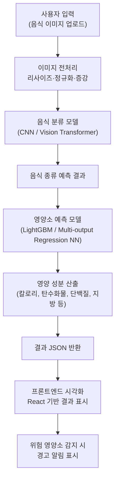

# GluFit 🍱
> 이미지 인식 기반 음식 영양 성분 분석 AI  
> *AI-based Nutrient Prediction System for Diabetic Diet Management*

---

## 🧩 프로젝트 개요
GluFit은 **음식 이미지 인식 기술**과 **AI 영양소 예측 모델**을 결합한 **지능형 식단 분석 시스템**입니다.  
입력된 음식 이미지를 분석해 음식 종류를 식별하고, 주요 영양 성분(탄수화물·단백질·지방 등)을 예측하여  
**당뇨 환자에게 위험한 성분을 감지하고 경고**합니다.

---

## ⚙️ 시스템 구성도

---

## 🧠 핵심 구성 요소

### 1. 데이터 수집 및 전처리
- **데이터 출처:** AI Hub, 공공데이터포털, 식품의약품안전처 영양성분DB  
- **전처리:** 이미지 크기 표준화, 라벨 검증, 중복 제거, 화질 필터링  
- **데이터 증강:** 회전·밝기 조정·Crop 등으로 일반화 성능 향상  
- **복합 음식 처리:** Segmentation 또는 Bounding Box 분리 (YOLO, Mask R-CNN)

---

### 2. AI 모델
#### 🍽 음식 분류 모델
- **모델 구조:** CNN 기반 또는 Vision Transformer  
- **출력:** 음식 종류 분류 (한식/중식/양식 등 다중 클래스)  
- **특징:** Transfer Learning 적용 (EfficientNet, MobileNet 등)  
- **성과 지표:** Accuracy, F1-score

#### 🧮 영양소 예측 모델
- **입력:** 분류된 음식의 이미지 특징 벡터  
- **모델:** LightGBM 또는 Multi-output Regression Neural Network  
- **출력:** 칼로리, 탄수화물, 단백질, 지방 등 주요 성분  
- **평가:** MAE, RMSE 기반 회귀 성능 검증  

---

### 3. 통합 추론 파이프라인
- 이미지 입력 → 전처리 → 음식 분류 → 영양소 회귀 → 결과 반환(JSON)
- 예측된 영양 정보는 REST API 형태로 전달
- 위험 영양소(고당·고탄수) 감지 시 경고 플래그 포함

---

### 4. 백엔드 구조 (Spring Boot)
| 구성요소 | 역할 | 기술 |
|-----------|------|------|
| **API 서버** | RESTful API 설계 및 CRUD 제공 | Spring Boot |
| **인증** | JWT 기반 토큰 인증 | Spring Security |
| **데이터베이스** | ORM 매핑 및 스키마 설계 | JPA / Hibernate / MySQL |
| **파일 처리** | 이미지 업로드·저장·다운로드 | MultipartFile |
| **데이터 검증** | Bean Validation, 전역 예외 처리 | @ControllerAdvice |
| **캐싱/로깅** | 응답 속도 향상 및 에러 추적 | Redis, Logback |
| **보안 설정** | HTTPS, CORS, XSS 방지 | Spring Security Headers |

---

### 5. 프론트엔드 구조 (React)
| 구성요소 | 역할 | 기술 |
|-----------|------|------|
| **UI 프레임워크** | SPA 기반 시각화 | React |
| **상태 관리** | 전역 상태 및 데이터 흐름 관리 | Redux |
| **비동기 통신** | 백엔드 API 연동 | Axios |
| **라우팅** | 페이지 전환 및 보호 라우트 | React Router |
| **반응형 디자인** | 디바이스별 최적화 | CSS Grid, Flexbox |
| **결과 시각화** | 영양소별 그래프 및 경고 표시 | Recharts / Chart.js |

---

## ⚠️ 기술적 고려사항 및 대응 전략
| 이슈 | 대응 방안 |
|------|------------|
| 한식 이미지 데이터 부족 | AI Hub + 공공데이터 통합 수집 |
| 복합 음식 구분 | Segmentation / Bounding Box 활용 |
| 이미지 편차(조명·각도) | 데이터 증강으로 일반화 성능 향상 |
| 영양 데이터 불일치 | 식약처 DB + 자체 매핑 테이블 구축 |
| 추론 지연 | 모델 경량화 및 비동기 추론 |
| 잘못된 경고 발생 | Threshold 조정 및 후처리 로직 적용 |

---

## 🧾 기술 스택
| 구분 | 기술 |
|------|------|
| **AI/ML** | TensorFlow, LightGBM, Scikit-learn, OpenCV |
| **Backend** | Spring Boot, JPA, JWT, Redis |
| **Frontend** | React, Redux, Axios, Chart.js |
| **Database** | MySQL |
| **Infra** | Docker, GitHub Actions (예정) |
| **ETC** | Notion, Google Docs, Discord |

---

## 📈 향후 확장 방향
- 이미지 기반 **비슷한 음식 추천 알고리즘**  
- **사용자 맞춤형 식단 리포트** 및 일일 섭취량 트래킹  
- **식품 영양소 실시간 API 연동** (식약처 OpenAPI 등)  
- **Edge Device 추론 최적화** 및 모바일 버전(Flutter) 확장  

---

## 🪪 License
This project was developed as part of *Sunmoon University AI Software Engineering SW Project (2025)*.  
All rights reserved © GluFit Team.
